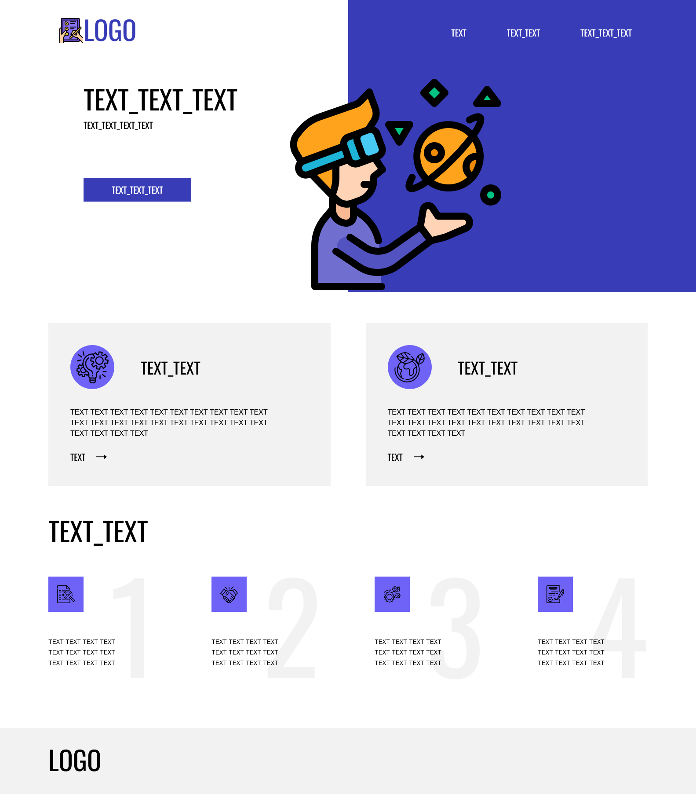

# Тестовое задание в Coub

[Посмотреть вживую](https://staskozin.github.io/coub-test-task/)

## Доступные команды

### `npm start`

Запускает приложение в режиме разработки.
Откройте [http://localhost:3000](http://localhost:3000), чтобы посмотреть в браузере.

### `npm run build`

Собирает приложение в папку `build` в режиме продакшена и оптимизирует сборку для лучшей производительности.
